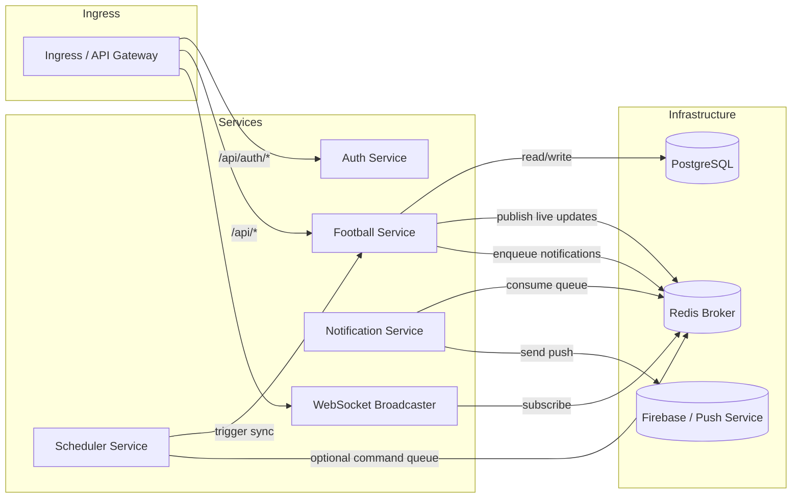

# Fover Backend Microservice Architecture

## Goal
Split the monolithic backend into distinct services for:
- Auth service
- Football service
- Scheduler service
- Notification service

Use a message queue/broker to decouple real-time updates and notification processing.

---

## Service boundaries

### 1. Auth Service
Responsibilities:
- User registration
- Login and refresh tokens
- JWT generation and validation
- User session and role claims

API surface:
- `/api/auth/register`
- `/api/auth/login`
- `/api/auth/refresh`

Data ownership:
- `users` database table
- authentication metadata

Notes:
- This service can be deployed independently and scaled separately from football sync workloads.
- It exposes only auth endpoints and issues tokens used by other services.

### 2. Football Service
Responsibilities:
- Football data API endpoints (matches, leagues, teams, news, ads)
- Fetching external football data from API-Football
- Writing/updating match state to PostgreSQL
- Publishing live match updates to a message broker
- Enqueuing notification events for downstream notification processing

API surface:
- `/api/leagues` / `/api/teams` / `/api/matches` / `/api/news` / `/api/ads`
- `/health` and `/health/ready`

Message duties:
- publish live updates to Redis pub/sub channel `fover:live_updates`
- push notification payloads to Redis queue `fover:notification:queue`

### 3. Scheduler Service
Responsibilities:
- Periodic live-sync jobs
- Daily or hourly refresh of league/match data
- Triggering football sync work without blocking API request handling

Implementation options:
- direct HTTP call to football service sync endpoints
- or publish internal commands to a queue, allowing football service workers to consume them

Current cookbook:
- Existing `scheduler_service.py` can become a dedicated service container that executes scheduled sync tasks.

### 4. Notification Service
Responsibilities:
- Consume notification queue
- Send notifications via FCM or other push service
- Retry failed messages
- Move permanent failures to a dead-letter queue

Message duties:
- read from `fover:notification:queue`
- write failures to `fover:notification:dead`

Notes:
- This service should be horizontally scalable to support notification throughput.
- It does not need to serve HTTP traffic beyond health/readiness.

---

## Message broker design

The current repository already uses Redis for two patterns:
- Redis pub/sub for live WebSocket broadcasting
- Redis list queue for notification events

This can be formalized as the messaging layer.

### Broker responsibilities
- `fover:live_updates` — pub/sub channel for real-time match broadcasts
- `fover:notification:queue` — reliable work queue for notifications
- `fover:notification:dead` — dead-letter queue for failed messages
- optional: `fover:command:sync` — command queue for scheduler-driven sync events

### Messaging flow
1. Football service processes live data and publishes update events.
2. WebSocket/real-time subsystem subscribes to live updates and forwards to connected clients.
3. Football service enqueues notification jobs when match events occur.
4. Notification service consumes jobs and delivers push notifications.
5. Scheduler service triggers sync tasks by publishing commands or calling football service.

---

## Kubernetes architecture

### Core deployments
- `auth-service` Deployment + Service
- `football-service` Deployment + Service
- `scheduler-service` Deployment + Service (or sidecar-less CronJob)
- `notification-service` Deployment + Service
- `redis` StatefulSet + Service
- `postgres` Deployment/StatefulSet + Service

### Scaling strategy
- `auth-service`: scale by request rate, lightweight CPU/memory
- `football-service`: scale based on API and sync load, CPU-bound due to external API calls
- `scheduler-service`: 1 or 2 replicas with leader election / singleton behavior
- `notification-service`: scale by queue depth and push throughput
- `redis`: scale with replicas and persistence; use master/slave or cluster depending on platform

### Health checks
Each service should expose:
- `/health/live` for liveness
- `/health/ready` for readiness

Example checks:
- `auth-service`: validate token signing, DB accessible
- `football-service`: DB accessible, Redis accessible
- `scheduler-service`: scheduler active, can reach football service or broker
- `notification-service`: can connect to Redis and FCM provider

### Ingress
- route API traffic to `auth-service` and `football-service`
- route websocket connections to the real-time/football service
- optional separate ingress path for metrics

---

## Proposed architecture diagram

---

## Recommended split for repository components

### Auth service
- `app/api/auth.py`
- `app/services/auth.py`
- `app/services/token.py`
- `app/core/security.py`
- `app/models/user.py`
- `app/schemas/user.py`, `app/schemas/token.py`

### Football service
- `app/api/matches.py`, `app/api/leagues.py`, `app/api/teams.py`, `app/api/news.py`, `app/api/ads.py`
- `app/services/football.py`
- `app/services/socket_service.py`
- `app/cache.py`
- `app/db/__init__.py`
- `app/models/*` for leagues/matches/teams/odds/standings
- `app/schemas/*`

### Scheduler service
- `scheduler_service.py`
- `app/services/scheduler.py`
- `app/monitoring.py` (metrics can remain shared or service-specific)

### Notification service
- `worker.py`
- `app/services/notification.py`
- `app/monitoring.py` (optional metrics)

---

## Next steps
1. Create separate Docker image contexts for each service.
2. Define service-specific Kubernetes manifests.
3. Externalize shared configuration via Secrets and ConfigMaps.
4. Convert scheduler commands to queue-based triggers if you want a fully event-driven design.
5. Add service-level observability and metrics endpoints.
